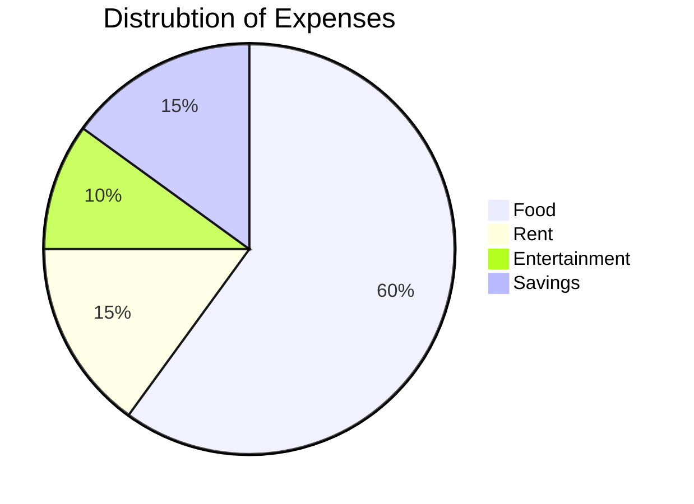

# Terminfindungsprojekt
 
## Softwaredesign (Architektur)

### Frontend

#### WPF

Wie in der Angabe vorgegeben, wurde eine WPF-Desktop Applikation erstellt. 
Diese Applikation hat eine intuitive GUI, wo Nutzer einfach und klar Termine von verschiedenen Organisationen verwalten können.
Hierbei wird mit REST-API Schnittstelle auf die Daten/Informationen zugegriffen.

Aufbau Pages / etc. : 

#### Angular-Web-App

Die Web-App, welche in Angular erstellt wurde, beinhaltet den gleichen inhaltlichen Aufbau wie die WPF-Desktop-App.
Es wurde sich für Angular entschieden, da es den Code lesbarer, einfacher und übersichtlicher macht. 

Hierbei wird auch auf die Daten/Informationen mithilfe der REST-API zugegriffen.

Aufbau Pages / etc. :

### Backend

#### MongoDB

Die Daten werden letztendlich in MongoDB persistent gespeichert. 
Es wurde MongoDB als Datenbank ausgewählt, da MongoDB sehr schnell Datenbankoperationen ausführen können.

Hierbei ist diese API, so aufgebaut

Modell:

#### Java Spring Boot (REST-API)

Für die REST-API wurde sich für Java Spring Boot entschieden.
Diese Entscheidung liegt auf der Grundlage, da bereits vorhandene Erkenntnisse in Java Spring Boot vorhanden waren.
Ebenso ist es sehr einfach und schnell eine API zu erstellen.
Die REST-API dient als einheitliche Schnittstelle für das Frontend und führt alle Datenbankoperationen Richtung der Datenbank.

## Beschreibung der Software

### Was tut die Software?

Der Sinn hinter dieser Software ist, dass es Nutzern und Organisationen eine  einfache Möglichkeit zur Verfügung gestellt wird, Termine innerhalb Organisationen und Personen zu verteilen und organisieren. 
Dies ist möglich, indem die Software eine Benutzerverwaltung beinhaltet und diese verschiedenen Organisationen beitreten können.
Nutzer können selber Organisationen und ebenfalls bei Organisationen anfragen dieser beizutreten. 
Um diese Anfrage bearbeiten zu können sowie Einstellungen an der Organisation durchzuführen, muss dieser Nutzer die Admin-Rechte einer Organisation haben.
Somit können Nutzer Mitglieder von mehreren Organisationen sein und all dessen Termine für sich selber verwalten. 
Ebenso können Nutzer noch Veränderungen bei Ihren eigenen Konto durchführen.

### Wozu ist sie gut?

Die Software soll somit damit dienen Menschen und Organisationen eine leichte Verteilung von Terminen sowie den Nutzer eine einfache Verwaltung ihrer Termine ermöglichen.

## API-Beschreibung

## Verwendung der API

Die API wird für die WPF-Anwendung sowie für Webseite immer wieder aufgerufen.

Die WPF-App beinhaltet eine Klasse "APICall", welche die 4 benötigten HTTP-Methoden (GET, POST, PUT, DELETE) beinhalten und somit in den verschiedenen Windows und UserControls aufgerufen werden:

//TODO: Image

Die Web-App beinhaltet ebenso eine Klasse, welche alle API-Requests und dafür notwendigen Objekte beinhaltet und somit ebenso in den unterschiedlichen aufgerufen werden:

//TODO: Image

## Diagramme

### Use-Cases

### Übersichtsdiagramm

## Diskussion der Ergebnisse

### Zusammenfassung

Insgesamt bietet das Terminfindungsprojekt eine effiziente Lösung für die Verwaltung von Terminen in verschiedenen Organisationen.
Durch die Nutzung moderner Technologien wie WPF, Angular, MongoDB und Java Spring Boot wird eine hohe Flexibilität und Skalierbarkeit gewährleistet.

### Hintergründe

Die Entscheidung für die verwendeten Technologien basiert auf vorhandenen Kenntnissen und deren Eignung für schnelle und zuverlässige Entwicklung. 
WPF bietet eine starke Desktop-Umgebung, während Angular für moderne Webanwendungen geeignet ist. 
MongoDB wurde aufgrund seiner schnellen Datenbankoperationen gewählt, und Java Spring Boot bietet eine robuste Plattform für die Entwicklung von REST-APIs.

### Ausblick

Zukünftige Erweiterungen könnten die Integration weiterer Funktionen wie Kalenderansichten, Benachrichtigungssysteme und mobile Apps umfassen. 
Zudem könnten Sicherheitsmaßnahmen wie Zwei-Faktor-Authentifizierung und erweiterte Rechteverwaltung implementiert werden, um die Anwendung noch sicherer und benutzerfreundlicher zu gestalten.

## Quellenverzeichnis / Links

[WPF Dokumentation](https://learn.microsoft.com/en-us/dotnet/desktop/wpf/?view=netdesktop-6.0)

[Angular Dokumentation](https://angular.io/docs)

[MongoDB Dokumentation](https://www.mongodb.com/docs/)

[Spring Boot Dokumentation](https://spring.io/projects/spring-boot)