# Terminfindungsprojekt
 
## Softwaredesign (Architektur)

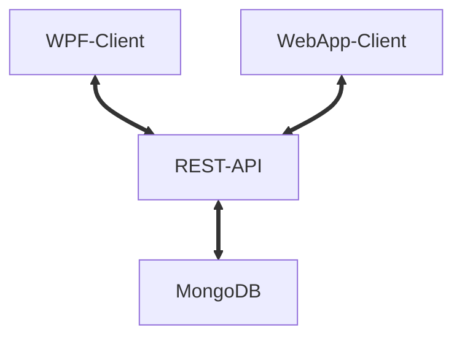

Die Architektur der Terminfindungsapp besteht aus dem Backend sowie dem Frontend.
Im Backend befindet sich als Kommunikationsschnittstelle eine REST-API, welche in Java Spring Boot implementiert wurde.
Diese Daten werden, welche von und zur REST-API gesendet werden, in MongoDB gespeichert. 
Im Fronted gibt es zwei Clients, die die gleiche Funktionalität haben.
Zu einem Seite haben wir eine WPF-Anwendung und auf der Anderen eine WebApp.

### Frontend

#### WPF

Wie in der Angabe vorgegeben, wurde eine WPF-Desktop Applikation erstellt. 
Diese Applikation hat eine intuitive GUI, wo Nutzer einfach und klar Termine von verschiedenen Organisationen verwalten können.
Hierbei wird mit REST-API Schnittstelle auf die Daten/Informationen zugegriffen.

#### Angular-Web-App

Die Web-App, welche in Angular erstellt wurde, beinhaltet den gleichen inhaltlichen Aufbau wie die WPF-Desktop-App.
Es wurde sich für Angular entschieden, da es den Code lesbarer, einfacher und übersichtlicher macht. 

Hierbei wird auch auf die Daten/Informationen mithilfe der REST-API zugegriffen.

### Backend

#### MongoDB

Die Daten werden letztendlich in MongoDB persistent gespeichert. 
Es wurde MongoDB als Datenbank ausgewählt, da MongoDB sehr schnell Datenbankoperationen ausführen können.

#### Java Spring Boot (REST-API)

Für die REST-API wurde sich für Java Spring Boot entschieden.
Diese Entscheidung liegt auf der Grundlage, da bereits vorhandene Erkenntnisse in Java Spring Boot vorhanden waren.
Ebenso ist es sehr einfach und schnell eine API zu erstellen.
Die REST-API dient als einheitliche Schnittstelle für das Frontend und führt alle Datenbankoperationen Richtung der Datenbank.

## Beschreibung der Software

### Was tut die Software und wozu ist sie gut?

Der Sinn hinter dieser Software ist, dass es Nutzern und Organisationen eine einfache Möglichkeit zur Verfügung gestellt wird, Termine innerhalb Organisationen und Personen zu verteilen und organisieren. 
Dies ist möglich, indem die Software eine Benutzerverwaltung beinhaltet und diese verschiedenen Organisationen beitreten können.
Nutzer können selber Organisationen und ebenfalls bei Organisationen anfragen dieser beizutreten. 
Um diese Anfrage bearbeiten zu können sowie Einstellungen an der Organisation durchzuführen, muss dieser Nutzer die Admin-Rechte einer Organisation haben.
Somit können Nutzer Mitglieder von mehreren Organisationen sein und all dessen Termine für sich selber verwalten. 
Ebenso können Nutzer noch Veränderungen bei Ihrem eigenen Konto durchführen.

## Funktionalitäten

Die Web-App sowie die WPF-App beinhalten die gleichen Funktionalitäten und sind gleich aufgebaut 

### Login

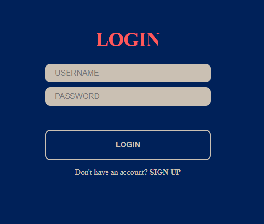

Mit klicken auf den **LOGIN**-Button wird sich für einen Nutzer eingeloggt.
Hierfür müssen **USERNAME**-Feld für den Nutzernamen und das dazugehörige Passwort in **PASSWORD** eingegeben werden.

### Registrieren

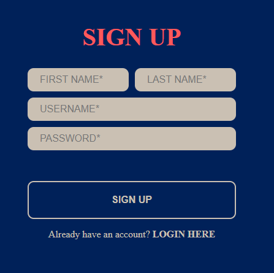

Mit klicken auf den **SIGN UP**-Button wird ein neuer Nutzer erstellt.
Hierfür müssen **FIRST NAME**, **LAST NAME**, **USERNAME** und **PASSWORD** eingegeben werden.


### Hauptfenster

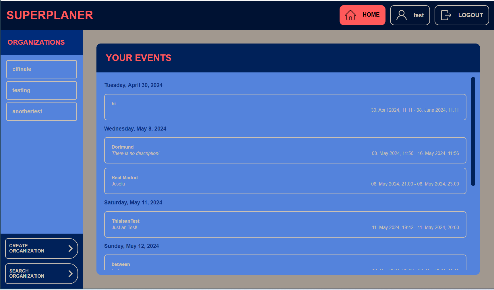

Nach dem Einloggen in einen Nutzerkonto öffnet sich dieses Hauptfenster.
Dort gibt es die Möglichkeit zwischen den Fenstern **Home**, **Nutzer-Information**, **Organisation erstellen** und **Organisation suchen** 
sowie die Möglichkeit einen gewünschte **Organisation** auszuwählen.
Des Weiteren kann sich unter **LOGOUT** abgemeldet werden.

Als Default-Fenster wird das **Home** Fenster angezeigt

#### Anzeige aller Nutzertermine

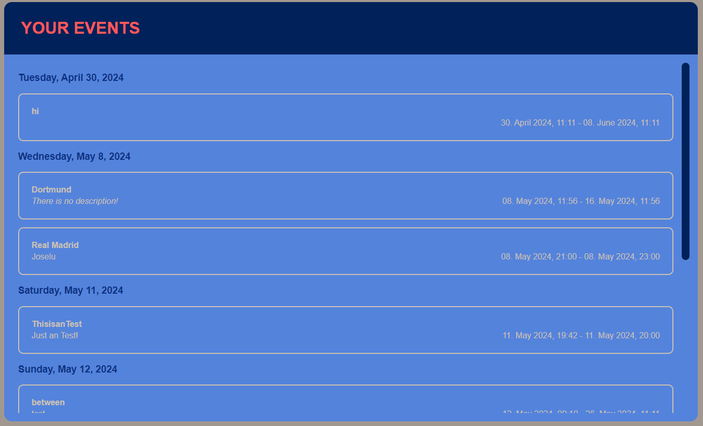

Durch das Klicken auf den **Home** Button gelangt man zu diesem Fenster.
Hier werden alle Termine des Nutzers, aufwärts sortiert, angezeigt.

#### Nutzerinformationen anzeigen und verändern

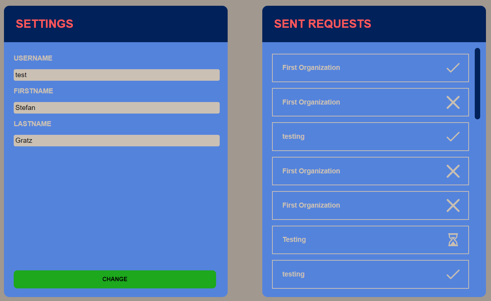

Durch das Klicken auf das **User-Icon** mit dem eingeloggten Nutzernamen gelangt man zu diesem Fenster.

Auf der linken Seite werden die aktuellen Nutzereinstellungen angezeigt.
Diese können durch Veränderungen der Eingabefelder und das Drücken des **CHANGE** Buttons verändert werden.

Auf der rechten Seite werden alle Beitrittsanfragen des Nutzers und deren Status angezeigt. 
Hierbei steht das **Hakerl** dafür das der Nutzer akzeptiert wurde,
das **X** dafür, dass er abgelehnt wurde 
und die **Sanduhr**, dass darüber noch nicht entschieden wurde.

#### Abmelden

Durch das Klicken auf den **LOGOUT** Button wird man mit dem Nutzer abgemeldet und zur Login-Seite navigiert.

#### Organisation erstellen

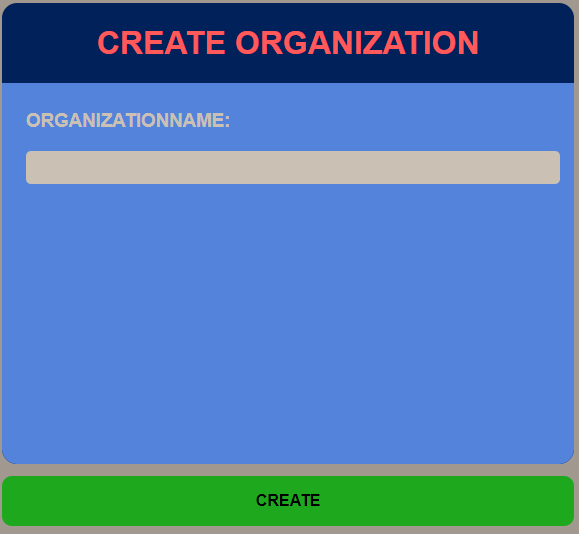

Mit dem Klicken auf den **CREATE ORGANIZATION** Button gelangt man zu diesem Fenster.
Mit Eingabe des Organisationsname in dem vorgesehenen Eingabefeld 
und durch das anschließende Klicken auf den **CREATE**-Button wird eine Organisation erstellt.

#### Beitrittsanfrage an Organisation


Mit dem Klicken auf den **SEARCH ORGANIZATION** Button gelangt man zu diesem Fenster.
Organisationen, welche den Input des Eingabefelds entspricht, werden darunter angezeigt.
Wenn bei diesen dann auf das Image klickt, wird eine Anfrage zum Beitritt der Organisation geschickt.

#### Organisation auswählen

Auf der linken Navigationsbar kann zwischen den verschiedenen Organisationen auswählen, indem man auf diese klickt.

Anschließend öffnet sich das Organisations-Fenster der Organisation:
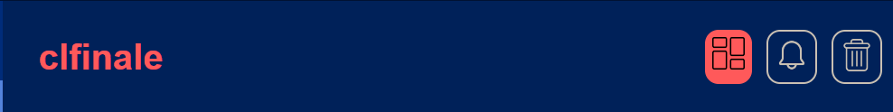

Dort kann zwischen dem Dashboard- und Request-Fenster navigiert werden. 
Als Default ist das Dashboard-Fenster ausgewählt.
Ebenfalls kann dort die Organisation gelöscht werden.

##### Organisationsinformationen

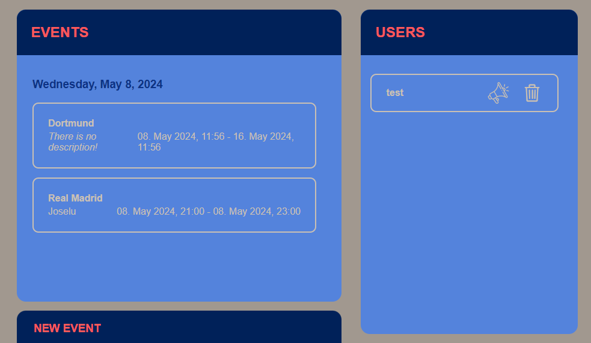

###### Events anzeigen

Wenn die Dashboard-Seite ausgewählt wurde, wird einem auf der linken Seite alle Events der Organisation sortiert angezeigt.

###### Event erstellen

Wenn man unter der Event-Anzeige auf den Button **NEW EVENT** klickt, faltet sich dieser Container aus:

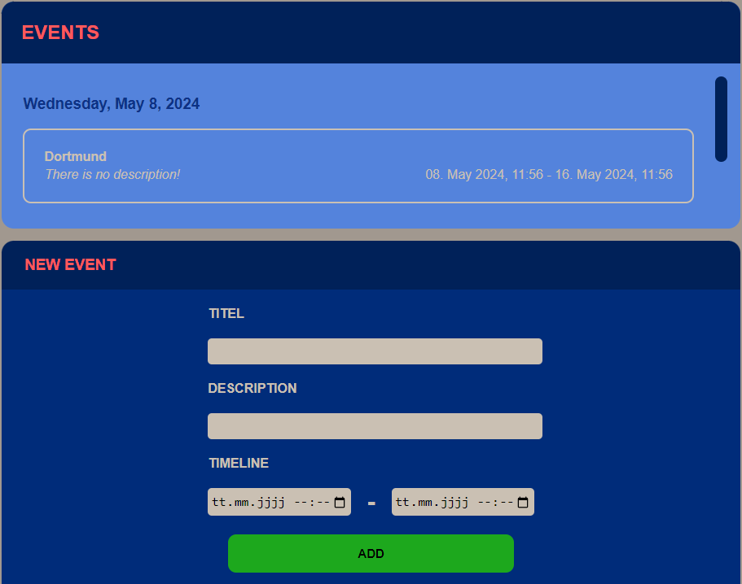

Um ein Event erfolgreich der Organisation muss das Eingabefeld **TITEL** sowie die **TIMELINE** ausgefüllt sein 
und anschließend auf **ADD** gedrückt werden.
Die **DESCRIPTION** ist optional einzugeben.

###### Nutzer anzeigen

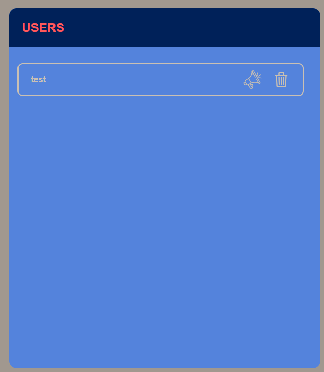

Alle Nutzer einer Organisation werden auf der rechten Seite des Dashboard-Fenster angezeigt.

###### Nutzer befördern

Diese angezeigten Nutzer können durch Klicken auf das **Megafon-Icon** zum Admin dieser Organisation befördert werden.
Um diese Operation durchzuführen, muss der Nutzer der Adminrechte besitzen.

###### Nutzer entfernen

Ebenso ist es möglich durch Klicken auf das **Mülltonnen-Icon** einen Nutzer zu löschen.
Um diese Operation durchzuführen, muss der Nutzer der Adminrechte besitzen.

##### Organisationsanfragen

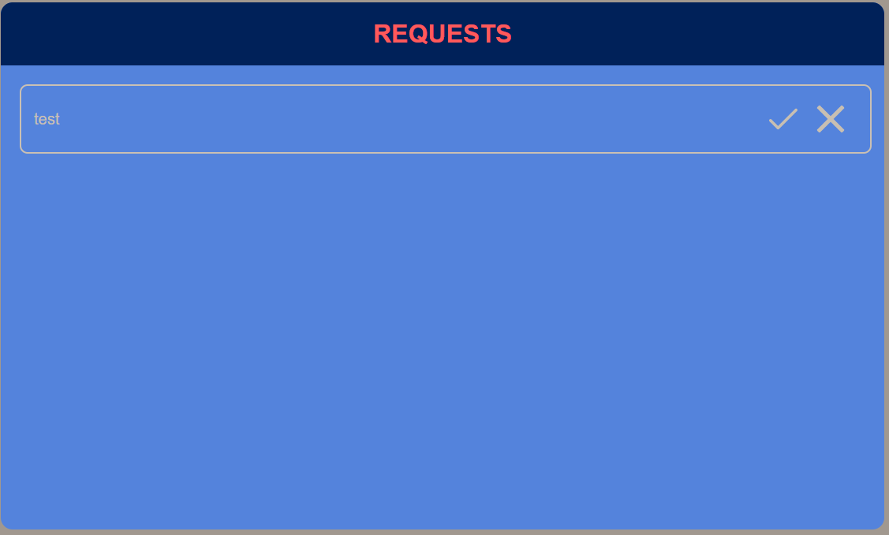

Wenn die Anfragen-Seite ausgewählt wurde, werden wie in der oberen Abbildung alle Anfragen zum Beitritt der Organisation angezeigt.
###### Anfragen an- und ablehnen

Bei jeder Anfrage stehen neben den Nutzernamen, auch zwei Icons nebenan.
Mit diesen ist es möglich den Nutzer an- bzw. abzulehnen.
Das **Hakerl** steht hierfür zum Annehmen.
Das **X** zum Ablehnen.

##### Organisation löschen


Organisation können mit dem Klicken auf dem **Mülltonnen-Icon** gelöscht werden.

## API

### Beschreibung

Die API passiert auf dem REST-Prinzip und wurde in Java Spring Boot entwickelt. 
Die REST-API dient für die Clients als Schnittstelle zur Datenbank.

### Endpunkte

Alle Endpunkte haben die Basis-URL **http://localhost:8080/api**

#### User

Zusätzlich zur Basis-URL haben Nutzerendpunkte immer **/user**.

<details>
  <summary>GET: /login</summary>

##### Beschreibung:
Endpunkt checkt ob Nutzer mit dazugehörigem Passwort existiert.

##### Request-Parameter:

`username`

- Typ: String
- Erforderlich: Ja
- Beschreibung: Der Benutzername des Nutzers.
- Beispiel: `maxmustermann`

`password`

- Typ: String
- Erforderlich: Ja
- Beschreibung: Das Password des Nutzers.
- Beispiel: `123456`

##### Return-Wert:
  ```json
  {
    "id": "663519a065014369ff6d96ac",
    "firstname": "Max",
    "lastname": "Mustermann",
    "username": "maxmustermann"
  }
  ```
</details>

<details>
  <summary>POST: /signup</summary>

##### Beschreibung:
Endpunkt erstellt neuen Nutzer.

##### Request-Body:

###### Felder
- **firstname**: erforderlich
- **lastname**: erforderlich
- **username**: erforderlich
- **password**: erforderlich

###### Beispiel
  ```json
  {
    "firstname": "Max",
    "lastname": "Mustermann",
    "username": "maxmustermann",
    "password": "123456"
  }
  ```

##### Return-Wert:
  ```json
  {
    "id": "663519a065014369ff6d96ac",
    "firstname": "Max",
    "lastname": "Mustermann",
    "username": "maxmustermann"
  }
  ```
</details>

<details>
  <summary>PUT: /modifyUser</summary>

##### Beschreibung:
Endpunkt verändert Nutzereinstellungen.

##### Request-Body:

###### Felder
- **id**: erforderlich
- **firstname**: optional
- **lastname**: optional
- **username**: optional

##### Beispiele
  ```json
  {
    "id": "663519a065014369ff6d96ac",
    "firstname": "Maxi",
    "lastname": "test",
    "username": "maxmustermann2"
  }
  ```

##### Return-Wert:
  ```json
  {
    "id": "663519a065014369ff6d96ac",
    "firstname": "Max",
    "lastname": "Mustermann",
    "username": "maxmustermann"
  }
  ```
</details>

#### Organization

Zusätzlich zur Basis-URL haben Organisationsendpunkte immer **/organization**.

<details>
  <summary>GET: /search/{pattern}</summary>

##### Beschreibung:
Endpunkt sucht nach allen Organisationen, die Pattern entsprechen.

##### Path-Variable:

`pattern`

- Typ: String
- Erforderlich: Ja
- Beschreibung: Pattern nach welchem Organisationsnamen gesucht werden soll.
- Beispiel: `Org`

##### Return-Wert:
  ```json
  [
      {
        "id": "663dd9256e14686b728f95a9",
        "name": "Organization"
      },
      {
        "id": "6640e8976b8b9360de41f364",
        "name": "Org"
      }
  ]
  ```
</details>

<details>
  <summary>GET: /searchOrganizations/{userid}</summary>

##### Beschreibung:
Endpunkt sucht nach allen Organisationen eines Nutzers

##### Path-Variable:

`userid`

- Typ: String
- Erforderlich: Ja
- Beschreibung: Nutzer-ID von dem Nutzer von welchen Organisationen herausgefunden werden möchte.
- Beispiel: `663519a065014369ff6d96ac`

##### Return-Wert:
  ```json
  [
      {
        "id": "663b4c3d382f773d084c5710",
        "name": "clfinale"
      },
      {
        "id": "663dd9256e14686b728f95a9",
        "name": "testing"
      },
      {
        "id": "6640e8976b8b9360de41f364",
        "name": "anothertest"
      }
  ]
  ```
</details>

<details>
  <summary>GET: /userListOrganization/{orgID}</summary>

##### Beschreibung:
Endpunkt returned alle Nutzer einer Organisation.

##### Path-Variable:

`orgid`

- Typ: String
- Erforderlich: Ja
- Beschreibung: Die ID von der Organisation von welcher man die Nutzerliste bekommen möchte.
- Beispiel: `663dd9256e14686b728f95a9`

##### Return-Wert:
  ```json
  [
      {
        "id": "663519a065014269ff6d96ac",
        "firstname": "Stefan",
        "lastname": "Gratz",
        "username": "test"
      },
      {
        "id": "663519a065014369ff6d96ac",
        "firstname": "Max",
        "lastname": "Mustermann",
        "username": "maxmustermann"
      }
  ]
  ```
</details>

<details>
  <summary>POST: /create</summary>

##### Beschreibung:
Endpunkt erstellt neue Organisation.

##### Request-Body:

###### Felder
- **name**: erforderlich
- **creatorid**: erforderlich

###### Beispiel
  ```json
  {
    "name": "Max's Organisation",
    "creatorid": "663519a065014369ff6d96ac"
  }
  ```

##### Return-Wert:
  ```text
  "66583952182e98150b8c0d48"
  ```
</details>

<details>
  <summary>PUT: /promote</summary>

##### Beschreibung:
Endpunkt befördert Nutzer zum Admin in einer Organisation.

##### Request-Parameter:

`orgid`

- Typ: String
- Erforderlich: Ja
- Beschreibung: Die ID der Organisation, worin Nutzer befördert werden soll
- Beispiel: `66583952182e98150b8c0d48`

`userid`

- Typ: String
- Erforderlich: Ja
- Beschreibung: Die ID des Nutzers, welchen befördert werden soll
- Beispiel: `663518b065014369ff6d96ac`

`adminid`

- Typ: String
- Erforderlich: Ja
- Beschreibung: Die ID des Nutzers, welchen den Nutzer befördert.
- Beispiel: `66583952182e98150b8c0d48`

##### Return-Wert:
  
  ```text
    "true"
  ```
**Oder:**
  ```text
    "false"
  ```
</details>

<details>
  <summary>DELETE: /delete/{id}</summary>

##### Beschreibung:
Endpunkt löscht Organisation.

##### Path-Variable:

`orgid`

- Typ: String
- Erforderlich: Ja
- Beschreibung: Die ID von der Organisation, welche man löschen möchte.
- Beispiel: `663dd9256e14686b728f95a9`

##### Return-Wert:
Gibt Anzahl der gelöschten Organisationen zurück.
  ```text
    "1"
  ```
**Oder:**
  ```text
    "0"
  ```
</details>

<details>
  <summary>DELETE: /removeUser</summary>

##### Beschreibung:
Endpunkt entfernt Nutzer von Organisation.

##### Request-Parameter:

`userid`

- Typ: String
- Erforderlich: Ja
- Beschreibung: Die ID des Nutzers, welchen man entfernen möchte.
- Beispiel: `663518b065014369ff6d96ac`

`orgid`

- Typ: String
- Erforderlich: Ja
- Beschreibung: Die ID der Organisation in welcher Nutzer entfernt werden soll
- Beispiel: `66583952182e98150b8c0d48`

`adminid`

- Typ: String
- Erforderlich: Ja
- Beschreibung: Die ID des Nutzers, welchen den Nutzer entfernt.
- Beispiel: `66583952182e98150b8c0d48`

##### Return-Wert:
Gibt zurück ob Nutzer entfernt werden konnte.
  ```text
    "true"
  ```
**Oder:**
  ```text
    "false"
  ```
</details>

#### Event
Zusätzlich zur Basis-URL haben Event-Endpunkte immer **/events**.

<details>
  <summary>GET: /search/{orgid}</summary>

##### Beschreibung:
Endpunkt returned alle Events einer Organisation.

##### Path-Variable:

`orgid`

- Typ: String
- Erforderlich: Ja
- Beschreibung: Die ID von der Organisation von welcher man die Nutzerliste bekommen möchte.
- Beispiel: `663dd9256e14686b728f95a9`

##### Return-Wert:
  ```json
  [
      {
        "id": "663fae2cf5a0eb686bbc7686",
        "titel": "ThisisanTest",
        "description": "Just an Test!",
        "datetimestart": "2024-05-11T19:42",
        "datetimeend": "2024-05-11T20:00",
        "organizationid": "663dd9256e14686b728f95a9"
      },
      {
        "id": "66486873f07cf04707142198",
        "titel": "hallo",
        "description": "teste",
        "datetimestart": "2024-05-12T12:12",
        "datetimeend": "2024-06-01T23:23",
        "organizationid": "663dd9256e14686b728f95a9"
      },
      {
        "id": "66486888f07cf04707142199",
        "titel": "mine",
        "description": "teste",
        "datetimestart": "2024-05-12T12:13",
        "datetimeend": "2024-06-01T23:23",
        "organizationid": "663dd9256e14686b728f95a9"
      }
  ]
  ```
</details>

<details>
  <summary>GET: /find/{userid}</summary>

##### Beschreibung:
Endpunkt returned alle Events eines Nutzers.

##### Path-Variable:

`userid`

- Typ: String
- Erforderlich: Ja
- Beschreibung: Die ID des Nutzers von welchem man die Events möchte.
- Beispiel: `663519a065014369ff6d96ac`

##### Return-Wert:
  ```json
  [
      {
        "id": "663b4c6a382f773d084c5711",
        "titel": "Dortmund",
        "datetimestart": "2024-05-08T11:56",
        "datetimeend": "2024-05-16T11:56",
        "organizationid": "663b4c3d382f773d084c5710"
      },
      {
        "id": "663c7ddf20444141c525ecff",
        "titel": "Real Madrid",
        "description": "Joselu",
        "datetimestart": "2024-05-08T21:00",
        "datetimeend": "2024-05-08T23:00",
        "organizationid": "663b4c3d382f773d084c5710"
      },
      {
        "id": "663fae2cf5a0eb686bbc7686",
        "titel": "ThisisanTest",
        "description": "Just an Test!",
        "datetimestart": "2024-05-11T19:42",
        "datetimeend": "2024-05-11T20:00",
        "organizationid": "663dd9256e14686b728f95a9"
      }
  ]
  ```
</details>

<details>
  <summary>POST: /add</summary>

##### Beschreibung:
Endpunkt erstellt neues Event in einer Organisation.

##### Request-Body:

###### Felder
- **titel**: erforderlich
- **description**: optional
- **datetimestart**: erforderlich
- **datetimeend**: erforderlich
- **organizationid**: erforderlich

###### Beispiel
  ```json
  {
    "titel": "New Event",
    "description": "This is an test!",
    "datetimestart": "2024-05-11T19:42",
    "datetimeend": "2024-06-11T19:42",
    "organizationid": "663dd9256e14686b728f95a9"
  }
  ```

##### Return-Wert:
  ```text
  "66584652182e98150b8c0d49"
  ```
</details>

#### Request
Zusätzlich zur Basis-URL haben Request-Endpunkte immer **/request**.

<details>
  <summary>GET: /findToOrganization/{orgid}</summary>

##### Beschreibung:
Endpunkt sucht nach allen Requests, die an Organisationen gesendet wurden.

##### Path-Variable:

`orgid`

- Typ: String
- Erforderlich: Ja
- Beschreibung: ID der Organisation.
- Beispiel: `Org`

##### Return-Wert:
  ```json
  [
      {
        "id": "66573d86f28e682d01db9046",
        "user": {
          "id": "663519a065014269ff6d96ac",
          "firstname": "Stefan",
          "lastname": "Gratz",
          "username": "test"
        },
        "org": {
          "id": "663dd9256e14686b728f95a9",
          "name": "testing"
        },
        "status": 0
      }
  ]
  ```
</details>

<details>
  <summary>GET: /findOfUser/{userid}</summary>

##### Beschreibung:
Endpunkt sucht nach allen Beitritts-Anfragen, welche ein Nutzer versendet hat.

##### Path-Variable:

`userid`

- Typ: String
- Erforderlich: Ja
- Beschreibung: ID des Nutzers
- Beispiel: `663519a065014369ff6d96ac`

##### Return-Wert:
  ```json
  [
  {
    "id": "663f7a6a0d3d59138876bf64",
    "user": {
      "id": "663519a065014269ff6d96ac",
      "firstname": "Stefan",
      "lastname": "Gratz",
      "username": "test"
    },
    "org": {
      "id": "663519c565014269ff6d96ae",
      "name": "First Organization"
    },
    "status": 2
  },
  {
    "id": "663f7a800d3d59138876bf65",
    "user": {
      "id": "663519a065014269ff6d96ac",
      "firstname": "Stefan",
      "lastname": "Gratz",
      "username": "test"
    },
    "org": {
      "id": "663519c565014269ff6d96ae",
      "name": "First Organization"
    },
    "status": 1
  },
  {
    "id": "663fa1d3bd1ed747ccf1d5c5",
    "user": {
      "id": "663519a065014269ff6d96ac",
      "firstname": "Stefan",
      "lastname": "Gratz",
      "username": "test"
    },
    "org": {
      "id": "663dd9256e14686b728f95a9",
      "name": "testing"
    },
    "status": 0
  }
]
  ```
</details>

<details>
  <summary>POST: /send</summary>

##### Beschreibung:
Endpunkt sendet neue Anfrage an eine Organisation von einem Nutzer.

##### Request-Body:

###### Felder
- **user**: erforderlich
- **org**: erforderlich

###### Beispiel
  ```json
  {
    "user": {
      "id": "663519a065014269ff6d96ac",
      "username": "test",
      "firstname": "Stefan",
      "lastname": "Gratz"
    },
    "org": {
      "id":  "663dd9256e14686b728f95a9",
      "name": "testing"
    }
  }
  ```

##### Return-Wert:
  ```json
  {
      "id": "665849af182e98150b8c0d4b",
      "user": {
        "id": "663519a065014269ff6d96ac",
        "firstname": "Stefan",
        "lastname": "Gratz",
        "username": "test"
      },
      "org": {
        "id": "663dd9256e14686b728f95a9",
        "name": "testing"
      },
      "status": 0
  }
  ```
</details>

<details>
  <summary>PUT: /changeStatus</summary>

##### Beschreibung:
Endpunkt verändert den Status der Request und somit wird hier übermittelt, ob der Nutzer angenommen bzw. abgelehnt wurde.

##### Request-Parameter:

`adminid`

- Typ: String
- Erforderlich: Ja
- Beschreibung: ID des Nutzers, welcher Nutzer annimmt oder ablehnt.
- Beispiel: `66583952182e98150b8c0d48`

##### Request-Body:

###### Felder
- **id**: erforderlich
- **user**: erforderlich
- **org**: erforderlich
- **status**: erforderlich

###### Beispiel
  ```json
  {
      "id": "665849af182e98150b8c0d4b",
      "user": {
        "id": "663519a065014269ff6d96ac",
        "firstname": "Stefan",
        "lastname": "Gratz",
        "username": "test"
      },
      "org": {
        "id": "663dd9256e14686b728f95a9",
        "name": "testing"
      },
      "status": 1
    }
  ```


##### Return-Wert:
Gibt die Anzahl der veränderten Requests zurück
  ```text
    1
  ```
**Oder:**
  ```text
    0
  ```
</details>

### Anwendung
Die API wird für die WPF-Anwendung sowie für Webseite immer wieder aufgerufen.

#### WPF
Die WPF-App beinhaltet eine statische Klasse **APICall**, welche die 4 benötigten HTTP-Methoden (GET, POST, PUT, DELETE) beinhalten und in den verschiedenen Windows sowie UserControls aufgerufen werden.

Diese 4 Methoden rufen alle diese private Funktion auf, welche den HTTPClient erstellt:

```csharp
private static HttpClient GetHttpClient(string url)
{
    // Creates HTTPClient with wanted URL
    var client = new HttpClient { BaseAddress = new Uri(url) };
        
    client.DefaultRequestHeaders.Accept.Clear();
    client.DefaultRequestHeaders.Accept.Add(new MediaTypeWithQualityHeaderValue("application/json"));
    
    return client;
}
```

<details>
  <summary>GET</summary>

```csharp
public static async Task<T> GetAsync<T>(string url, string urlParameters)
{
    try
    {
        using (var client = GetHttpClient(url))
        {
            // Get response of Request
            HttpResponseMessage response = await client.GetAsync(urlParameters);
            // Checks if Everything went good
            if (response.StatusCode == HttpStatusCode.OK)
            {
                // Returning Response in wanted Object
                string json = await response.Content.ReadAsStringAsync();
                var result = JsonSerializer.Deserialize<T>(json);
                return result;
            }

            return default(T);
        }
    }
    catch (Exception ex)
    {
        Console.WriteLine(ex.Message);
        return default(T);
    }
}
```
</details>

<details>
  <summary>POST</summary>

```csharp
public static async Task<bool> PostAsync<T>(string url, T data)
{
    try
    {
        using (var client = GetHttpClient(url))
        {
            // Formats Object into JSON
            string json = JsonSerializer.Serialize<T>(data);
            
            // Sends POST-Request
            var response = client.PostAsync(url, new StringContent(json, Encoding.UTF8, "application/json")).Result;

            // Return if everything went good
            return response.IsSuccessStatusCode;
        }
    }
    catch (Exception ex)
    {
        Console.WriteLine(ex.Message);
        return false;
    }
}
```
</details>

<details>
  <summary>PUT</summary>

```csharp
public static async Task<bool> PutAsync<T>(string url, T data)
{
    try
    {
        using (var client = GetHttpClient(url))
        {
            // Formats Object into JSON
            string json = JsonSerializer.Serialize(data);
            // Sends PUT-Request
            var response = client.PutAsync(url, new StringContent(json, Encoding.UTF8, "application/json")).Result;
            // Return if everything went good (Checks also if one element got changed)
            return response.IsSuccessStatusCode && Convert.ToInt32(await response.Content.ReadAsStringAsync()) == 1;
        }
    }
    catch (Exception ex)
    {
        Console.WriteLine(ex.Message);
        return false;
    }
}
```
</details>

<details>
  <summary>DELETE</summary>

```csharp
public static async Task<T> DeleteAsync<T>(string url)
{
    try
    {
        using (var client = GetHttpClient(url))
        {
            // Sends DELETE-Request
            var response = client.DeleteAsync(url).Result;

            // Returns Response in wanted Object
            return (T)Convert.ChangeType(await response.Content.ReadAsStringAsync(), typeof(T));
        }
    }
    catch (Exception ex)
    {
        Console.WriteLine(ex.Message);
        return default(T);
    }
}
```
</details>

#### Web-App

Die Web-App beinhaltet ebenso eine statische Klasse **AuthService**, welche alle API-Requests und dafür notwendigen Objekte beinhaltet und somit ebenso in den unterschiedlichen Components aufgerufen werden.

Hier sind exemplarische Beispiele, wie eine Anfrage an die REST-API gestellt wurde.

<details>
  <summary>GET</summary>

```typescript
getuserorganizations(userid: string){
    return this.http.get<Organization[]>(`${this.apiUrl}organization/searchOrganizations/${userid}`);
}
```
</details>

<details>
  <summary>POST</summary>

```typescript
createorganization(org: Organization){
    return this.http.post(`${this.apiUrl}organization/create`, org, {responseType: "text"});
}
```
</details>

<details>
  <summary>PUT</summary>

```typescript
promoteUser(userid: string | undefined, orgid: string | undefined, adminid: string | undefined) {
    return this.http.put(`${this.apiUrl}organization/promote?userid=${userid}&orgid=${orgid}&adminid=${adminid}`, null);
}
```
</details>

<details>
  <summary>DELETE</summary>

```typescript
removeuserorganization(userid: string | undefined, orgid: string | undefined, adminid: string | undefined) {
    return this.http.delete(`${this.apiUrl}organization/removeUser?userid=${userid}&orgid=${orgid}&adminid=${adminid}`);
}
```
</details>

## Diagramme

### Klassendiagramme

#### WPF-App

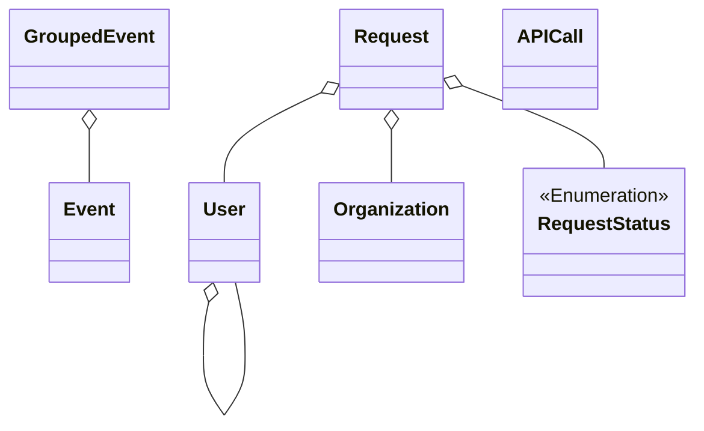

#### Web-App


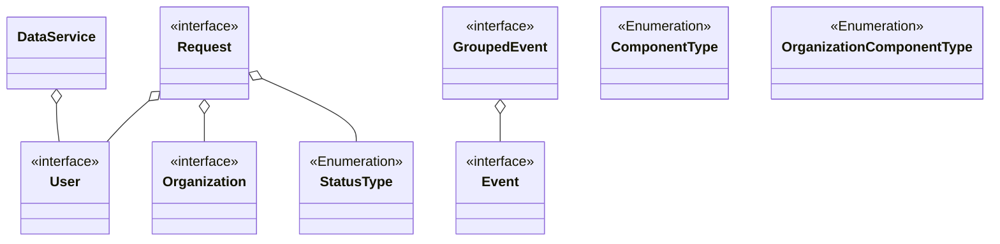

#### REST-API

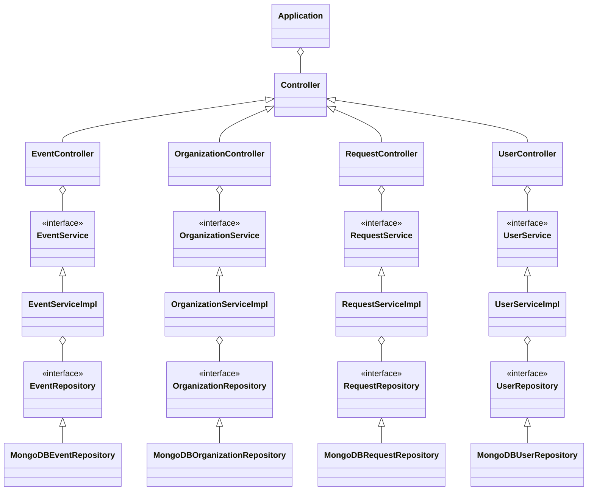

## Diskussion der Ergebnisse

### Zusammenfassung

Insgesamt bietet das Terminfindungsprojekt eine effiziente Lösung für die Verwaltung von Terminen in verschiedenen Organisationen.
Mithilfe einer intuitiven und benutzerfreundlichen Arbeitsumgebung ist das Programm sehr einfach zu verwenden.
Durch die Nutzung moderner Technologien wie WPF, Angular, MongoDB und Java Spring Boot wird eine hohe Flexibilität und Skalierbarkeit gewährleistet.
Ebenso wurde auch sehr auf die Sicherheit der Daten geachtet.

Während der Durchführung des Projektes kam es zum Spontanen weglassen von Funktionalitäten sowie Abänderungen.
Zum Beispiel wurde keine Funktionalität implementiert, welche den Nutzer benachrichtigt, wenn ein Termin ihm zugewiesen wurde oder ein Termin beginnt.
Dies hat der Grund da, dass Projekt-Umfang schon ziemlich groß war und für die Implementierung einer solchen Funktion keine Zeit mehr gab.
Des Weiteren wurde umentschieden, dass statt wie im Projektauftrag Einladungen von Admins aus Organisationen kommen, nun der Nutzer die Organisationen anfragt und diese können ihn dann ablehnen bzw. annehmen.
Die Entscheidung beruhte darauf, dass es vom Design der GUI leichter gestalten ließ, 
dies im Main-Window als zusätzliche Funktionalität zu implementieren als alle Funktionalitäten in die Organisations-Pages reinzustopfen.

### Hintergründe

Die Entscheidung für die verwendeten Technologien basiert auf vorhandenen Kenntnissen und deren Eignung für schnelle und zuverlässige Entwicklung. 
WPF bietet eine starke Desktop-Umgebung, während Angular für moderne Webanwendungen geeignet ist. 
MongoDB wurde aufgrund seiner schnellen Datenbankoperationen gewählt, und Java Spring Boot bietet eine robuste Plattform für die Entwicklung von REST-APIs.

### Ausblick

Zukünftige Erweiterungen könnten die Integration weiterer Funktionen wie verschiedene Kalenderansichten und Benachrichtigungssysteme umfassen. 
Zudem könnten Sicherheitsmaßnahmen wie Zwei-Faktor-Authentifizierung und erweiterte Rechteverwaltung implementiert werden, um die Anwendung noch sicherer und benutzerfreundlicher zu gestalten.

Aspekte, die nicht implementiert werden konnten, wie Benachrichtigungen an Nutzer, wenn ein Termin zugewiesen oder ansteht, können ebenso in Zukunft auch noch implementiert werden.

## Quellenverzeichnis / Links

[WPF Dokumentation](https://learn.microsoft.com/en-us/dotnet/desktop/wpf/?view=netdesktop-6.0)

[Angular Dokumentation](https://angular.io/docs)

[MongoDB Dokumentation](https://www.mongodb.com/docs/)

[Spring Boot Dokumentation](https://spring.io/projects/spring-boot)