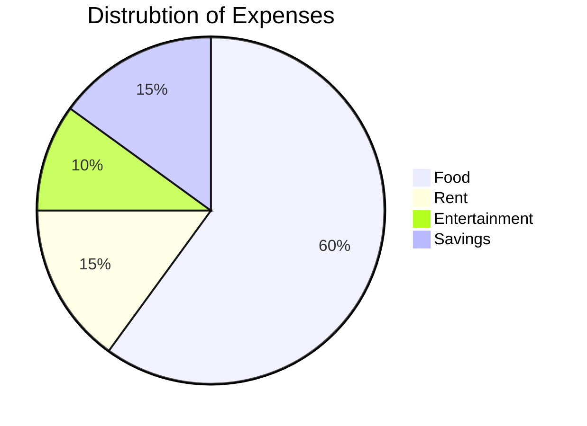

# Terminfindungsprojekt
 
## Softwaredesign (Architektur)

## Beschreibung der Software

### Was tut die Software?

### Wozu ist sie gut?

## API-Beschreibung

## Verwendung der API

## Diagramme

### Use-Cases

### Übersichtsdiagramm

## Diskussion der Ergebnisse

### Zusammenfassung

### Hintergründe

### Ausblick

## Quellenverzeichnis / Links