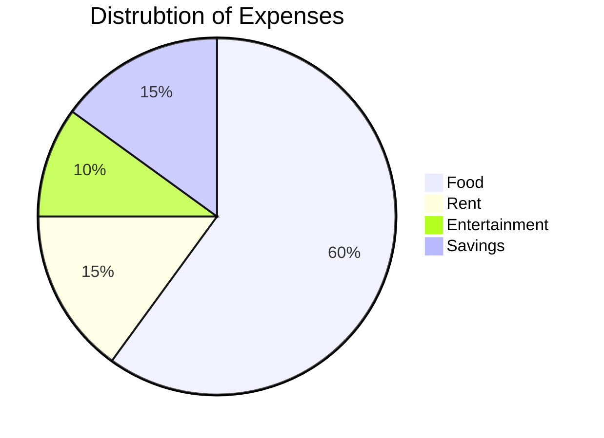

# Terminfindungsprojekt
 
## Softwaredesign (Architektur)

## Beschreibung der Software

### Was tut die Software?

Der Sinn hinter dieser Software ist, dass es Nutzern und Organisationen eine  einfache Möglichkeit zur Verfügung gestellt wird, Termine innerhalb Organisationen und Personen zu verteilen und organisieren. 
Dies ist möglich, indem die Software eine Benutzerverwaltung beinhaltet und diese verschiedenen Organisationen beitreten können.
Nutzer können selber Organisationen und ebenfalls bei Organisationen anfragen dieser beizutreten. Um diese Anfrage bearbeiten zu können sowie Einstellungen an der Organisation durchzuführen, muss dieser Nutzer die Admin-Rechte einer Organisation haben.
Dadurch können Nutzer Mitglieder von mehreren Organisationen sein und all dessen Termine für sich selber verwalten. Ebenso können Nutzer noch eigene Veränderungen bei ihren Konto durchführen.

### Wozu ist sie gut?

Die Software soll somit damit dienen Menschen und Organisationen eine leichte Verteilung von Terminen sowie den Nutzer eine einfache Verwaltung ihrer Termine ermöglichen.

## API-Beschreibung

## Verwendung der API

Die API wird für die WPF-Anwendung sowie für Webseite immer wieder aufgerufen.

Die WPF-App beinhaltet eine Klasse "APICall", welche die 4 benötigten HTTP-Methoden (GET, POST, PUT, DELETE) beinhalten und somit in den verschiedenen Windows und UserControls aufgerufen werden:

//TODO: Image

Die Web-App beinhaltet ebenso eine Klasse, welche alle API-Requests und dafür notwendigen Objekte beinhaltet und somit ebenso in den unterschiedlichen aufgerufen werden:

//TODO: Image

## Diagramme

### Use-Cases

### Übersichtsdiagramm

## Diskussion der Ergebnisse

### Zusammenfassung

### Hintergründe

### Ausblick

## Quellenverzeichnis / Links