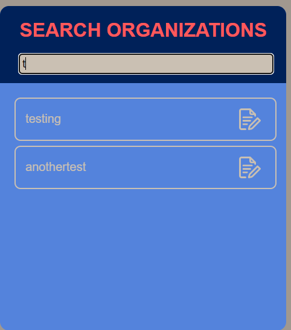

# Terminfindungsprojekt
 
## Softwaredesign (Architektur)

Die Architektur der Terminfindungsapp besteht aus dem Backend sowie dem Frontend.
Im Backend befindet sich als Kommunikationsschnittstelle eine REST-API, welche in Java Spring Boot implementiert wurde.
Diese Daten werden, welche von und zur REST-API gesendet werden, in MongoDB gespeichert. 
Im Fronted gibt es zwei Clients, die die gleiche Funktionalität haben.
Zur einer Seite haben wir eine WPF-Anwendung und auf der Anderen eine WebApp.

### Frontend

#### WPF

Wie in der Angabe vorgegeben, wurde eine WPF-Desktop Applikation erstellt. 
Diese Applikation hat eine intuitive GUI, wo Nutzer einfach und klar Termine von verschiedenen Organisationen verwalten können.
Hierbei wird mit REST-API Schnittstelle auf die Daten/Informationen zugegriffen.

#### Angular-Web-App

Die Web-App, welche in Angular erstellt wurde, beinhaltet den gleichen inhaltlichen Aufbau wie die WPF-Desktop-App.
Es wurde sich für Angular entschieden, da es den Code lesbarer, einfacher und übersichtlicher macht. 

Hierbei wird auch auf die Daten/Informationen mithilfe der REST-API zugegriffen.

### Backend

#### MongoDB

Die Daten werden letztendlich in MongoDB persistent gespeichert. 
Es wurde MongoDB als Datenbank ausgewählt, da MongoDB sehr schnell Datenbankoperationen ausführen können.

#### Java Spring Boot (REST-API)

Für die REST-API wurde sich für Java Spring Boot entschieden.
Diese Entscheidung liegt auf der Grundlage, da bereits vorhandene Erkenntnisse in Java Spring Boot vorhanden waren.
Ebenso ist es sehr einfach und schnell eine API zu erstellen.
Die REST-API dient als einheitliche Schnittstelle für das Frontend und führt alle Datenbankoperationen Richtung der Datenbank.

## Beschreibung der Software

### Was tut die Software und wozu ist sie gut?

Der Sinn hinter dieser Software ist, dass es Nutzern und Organisationen eine einfache Möglichkeit zur Verfügung gestellt wird, Termine innerhalb Organisationen und Personen zu verteilen und organisieren. 
Dies ist möglich, indem die Software eine Benutzerverwaltung beinhaltet und diese verschiedenen Organisationen beitreten können.
Nutzer können selber Organisationen und ebenfalls bei Organisationen anfragen dieser beizutreten. 
Um diese Anfrage bearbeiten zu können sowie Einstellungen an der Organisation durchzuführen, muss dieser Nutzer die Admin-Rechte einer Organisation haben.
Somit können Nutzer Mitglieder von mehreren Organisationen sein und all dessen Termine für sich selber verwalten. 
Ebenso können Nutzer noch Veränderungen bei Ihrem eigenen Konto durchführen.

## Funktionalitäten

Die Web-App sowie die WPF-App beinhalten die gleichen Funktionalitäten und sind gleich aufgebaut 

### Login

Mit klicken auf den **LOGIN**-Button wird sich für einen Nutzer eingeloggt.
Hierfür müssen **USERNAME**-Feld für den Nutzernamen und das dazugehörige Passwort in **PASSWORD** eingegeben werden.

### Registrieren

Mit klicken auf den **SIGN UP**-Button wird ein neuer Nutzer erstellt.
Hierfür müssen **FIRST NAME**, **LAST NAME**, **USERNAME** und **PASSWORD** eingegeben werden.

### Hauptfenster

Nach dem Einloggen in einen Nutzerkonto öffnet sich dieses Hauptfenster.
Dort gibt es die Möglichkeit zwischen den Fenstern **Home**, **Nutzer-Information**, **Organisation erstellen** und **Organisation suchen** 
sowie die Möglichkeit einen gewünschte **Organisation** auszuwählen.
Des Weiteren kann sich unter **LOGOUT** abgemeldet werden.

Als Default-Fenster wird das **Home** Fenster angezeigt

#### Anzeige aller Nutzertermine

Durch das Klicken auf den **Home** Button gelangt man zu diesem Fenster.
Hier werden alle Termine des Nutzers, aufwärts sortiert, angezeigt.

#### Nutzerinformationen anzeigen und verändern

Durch das Klicken auf das **User-Icon** mit dem eingeloggten Nutzernamen gelangt man zu diesem Fenster.

Auf der linken Seite werden die aktuellen Nutzereinstellungen angezeigt.
Diese können durch Veränderungen der Eingabefelder und das Drücken des **CHANGE** Buttons verändert werden.

Auf der rechten Seite werden alle Beitrittsanfragen des Nutzers und deren Status angezeigt. 
Hierbei steht das **Hakerl** dafür das der Nutzer akzeptiert wurde,
das **X** dafür, dass er abgelehnt wurde 
und die **Sanduhr**, dass darüber noch nicht entschieden wurde.

#### Abmelden

Durch das Klicken auf den **LOGOUT** Button wird man mit dem Nutzer abgemeldet und zur Login-Seite navigiert.

#### Organisation erstellen

Mit dem Klicken auf den **CREATE ORGANIZATION** Button gelangt man zu diesem Fenster.
Mit Eingabe des Organisationsname in dem vorgesehenen Eingabefeld 
und durch das anschließende Klicken auf den **CREATE**-Button wird eine Organisation erstellt.

#### Beitrittsanfrage an Organisation

Mit dem Klicken auf den **SEARCH ORGANIZATION** Button gelangt man zu diesem Fenster.
Organisationen, welche den Input des Eingabefelds entspricht, werden darunter angezeigt.
Wenn bei diesen dann auf das Image klickt, wird eine Anfrage zum Beitritt der Organisation geschickt.

#### Organisation auswählen

Auf der linken Navigationsbar kann zwischen den verschiedenen Organisationen auswählen, indem man auf diese klickt.

Anschließend öffnet sich das Organisations-Fenster der Organisation:

Dort kann zwischen dem Dashboard- und Request-Fenster navigiert werden. 
Als Default ist das Dashboard-Fenster ausgewählt.
Ebenfalls kann dort die Organisation gelöscht werden.

##### Organisationsinformationen

###### Events anzeigen

Wenn die Dashboard-Seite ausgewählt wurde, wird einem auf der linken Seite alle Events der Organisation sortiert angezeigt.

###### Event erstellen

Wenn man unter der Event-Anzeige auf den Button **NEW EVENT** klickt, faltet sich dieser Container aus:

Um ein Event erfolgreich der Organisation muss das Eingabefeld **TITEL** sowie die **TIMELINE** ausgefüllt sein 
und anschließend auf **ADD** gedrückt werden.
Die **DESCRIPTION** ist optional einzugeben.

###### Nutzer anzeigen

Alle Nutzer einer Organisation werden auf der rechten Seite des Dashboard-Fenster angezeigt.

###### Nutzer befördern

Diese angezeigten Nutzer können durch Klicken auf das **Megafon-Icon** zum Admin dieser Organisation befördert werden.
Um diese Operation durchzuführen, muss der Nutzer der Adminrechte besitzen.

###### Nutzer entfernen

Ebenso ist es möglich durch Klicken auf das **Mülltonnen-Icon** einen Nutzer zu löschen.
Um diese Operation durchzuführen, muss der Nutzer der Adminrechte besitzen.

##### Organisationsanfragen

Wenn die Anfragen-Seite ausgewählt wurde, werden wie in der oberen Abbildung alle Anfragen zum Beitritt der Organisation angezeigt.
###### Anfragen an- und ablehnen

Bei jeder Anfrage stehen neben den Nutzernamen, auch zwei Icons nebenan.
Mit diesen ist es möglich den Nutzer an- bzw. abzulehnen.
Das **Hakerl** steht hierfür zum Annehmen.
Das **X** zum Ablehnen.

##### Organisation löschen

Organisation können mit dem Klicken auf dem **Mülltonnen-Icon** gelöscht werden.

## Verwendung der API

Die API wird für die WPF-Anwendung sowie für Webseite immer wieder aufgerufen.

Die WPF-App beinhaltet eine Klasse "APICall", welche die 4 benötigten HTTP-Methoden (GET, POST, PUT, DELETE) beinhalten und somit in den verschiedenen Windows und UserControls aufgerufen werden:

//TODO: Image

Die Web-App beinhaltet ebenso eine Klasse, welche alle API-Requests und dafür notwendigen Objekte beinhaltet und somit ebenso in den unterschiedlichen aufgerufen werden:

//TODO: Image

## Diagramme

### Klassendiagramme

#### WPF-App

#### Web-App

#### REST-API

// TODO: Ueberarbeiten da Klassen bei anderen noch drinnen ist und kleiner Daten-Klasse mitimplementieren

### Use-Cases

### Übersichtsdiagramm

## Diskussion der Ergebnisse

### Zusammenfassung

Insgesamt bietet das Terminfindungsprojekt eine effiziente Lösung für die Verwaltung von Terminen in verschiedenen Organisationen.
Durch die Nutzung moderner Technologien wie WPF, Angular, MongoDB und Java Spring Boot wird eine hohe Flexibilität und Skalierbarkeit gewährleistet.

### Hintergründe

Die Entscheidung für die verwendeten Technologien basiert auf vorhandenen Kenntnissen und deren Eignung für schnelle und zuverlässige Entwicklung. 
WPF bietet eine starke Desktop-Umgebung, während Angular für moderne Webanwendungen geeignet ist. 
MongoDB wurde aufgrund seiner schnellen Datenbankoperationen gewählt, und Java Spring Boot bietet eine robuste Plattform für die Entwicklung von REST-APIs.

### Ausblick

Zukünftige Erweiterungen könnten die Integration weiterer Funktionen wie Kalenderansichten, Benachrichtigungssysteme und mobile Apps umfassen. 
Zudem könnten Sicherheitsmaßnahmen wie Zwei-Faktor-Authentifizierung und erweiterte Rechteverwaltung implementiert werden, um die Anwendung noch sicherer und benutzerfreundlicher zu gestalten.

## Quellenverzeichnis / Links

[WPF Dokumentation](https://learn.microsoft.com/en-us/dotnet/desktop/wpf/?view=netdesktop-6.0)

[Angular Dokumentation](https://angular.io/docs)

[MongoDB Dokumentation](https://www.mongodb.com/docs/)

[Spring Boot Dokumentation](https://spring.io/projects/spring-boot)